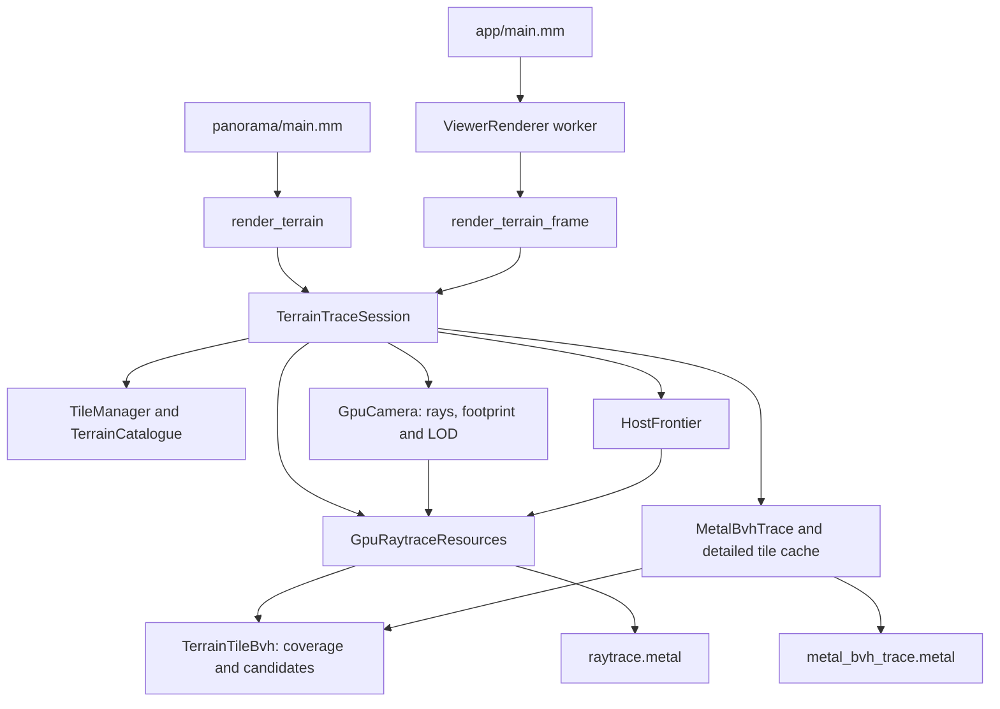
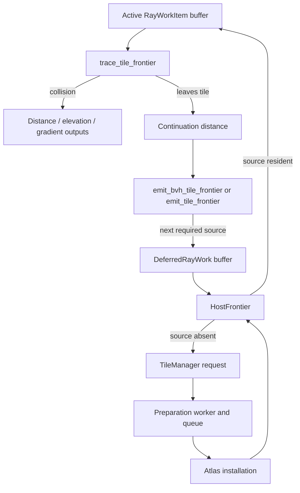
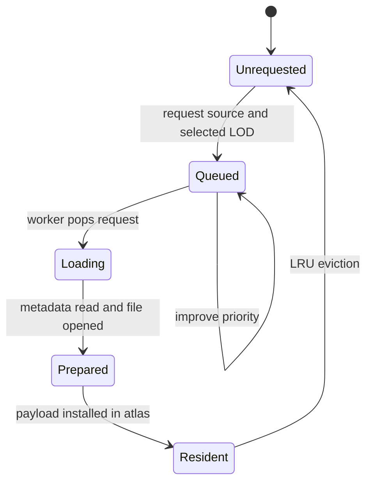

# Source architecture

Panorama turns prepared digital terrain model tiles into distance, elevation,
normal, shadow, and colour images. Metal kernels perform ray generation,
terrain traversal, and image presentation. The batch renderer and AppKit viewer
share the same tracing session and terrain-loading code.

## Source directories

- `panorama/`: batch arguments, projection requests, rendering, and PNG output.
- `app/`: AppKit controls, the persistent render worker, navigation, location
  search, peak labels, astronomical lighting, and the MapKit minimap.
- `raytracing/`: coordinate frames, GPU camera/LOD planning, terrain catalogues,
  tile residency, software frontiers, and Metal BVH traversal.
- `rendering/`: diagnostic and shaded image kernels, the complete GPU frame
  producer, minimap visibility kernels, and PNG encoding.
- `tile-gen/`: source-raster discovery, rechunking, and prepared-tile generation.
- `shared/`: tile and manifest formats, valid-cell coverage, GDAL helpers, and
  argument utilities.

## Request flow

Both entry points converge on `TerrainTraceSession`:

`RayFieldRequest` describes an angular panorama or calibrated camera projection.
`gpu_camera.metal` generates horizontal ray directions and slopes, including
Brown–Conrady lens inversion, and selects source LODs on the GPU. Projection
footprints and LOD plans are cached: rotations reuse them; projection, image
size, observer position, or LOD-scale changes update the relevant plan.

The batch renderer creates a short-lived session. The viewer retains its
catalogue, atlas, workers, pipelines, and detailed BVH cache across frames.

## Prepared terrain and coordinate frames

`SourceCatalogue` discovers GeoTIFF, SRTM HGT, and Arc/Info ASC rasters,
including ASC members of ZIP archives. `rechunker.mm` reads overlapping source
windows without reprojection or resampling. Each generation run requires one
compatible CRS, resolution, pixel registration, and aligned sample grid.

`metal_tile_writer.mm` writes version-5 uint16 tiles with independently
addressable LOD payloads. Code zero denotes no-data; valid elevations decode as
`(base + code) / 10` metres. A cell is usable only when all four corners are
valid. Coverage rectangles follow the LOD table. The version-3
`panorama-terrain-manifest.bin` records tile coordinates, elevation bounds
across all stored LODs, and usable-cell coverage.

`TerrainCatalogue` discovers an ordered dataset stack. Earlier datasets own
overlapping valid terrain; later datasets fill gaps. Datasets may differ in CRS
and spacing, but their tile cell counts, mipmap/LOD layouts, sample types, and
compression must match. Configured vertical offsets apply to heights and bounds.

Public observer locations use WGS 84 `LatLon` and absolute elevation.
`crs.mm` supplies GDAL/PROJ transforms and geodesic movement. A single
projected-metre dataset can retain its native metric frame; geographic terrain
and multi-dataset stacks use a fixed local azimuthal-equidistant frame.
True-north camera and sun directions are converted into that frame's local
basis at the observer.

`terrain_transform.mm` subdivides transformed terrain into affine geometry
patches, targeting a 0.25 m horizontal residual. Coverage uses separately
tessellated polygons with shared projected edge vertices. It determines valid
intervals and priority; it does not supply a collision surface. Partial or
priority-clipped sources retain native resolution so coarse geometry cannot
expand across an ownership boundary.

Geographic terrain and multiple datasets require `Raytracer::MetalBvh`.
The software backend, shown as Mipmap in the viewer, supports a single
projected-metre dataset.

## Session setup and relocation

`TerrainTraceSession::State` establishes ownership in this order:

1. `TileManager` creates the catalogue, reads reference geometry, and starts
   with LOD 1 before a GPU plan is installed.
2. `GpuRaytraceResources` selects or inherits a Metal device/command queue,
   compiles traversal pipelines for retained uint16 or expanded Float32 atlas
   data, and allocates ray outputs and catalogue lookup buffers.
3. `TileManager::attach_gpu` allocates the atlas, loads the initial observer
   tile into slot zero, and starts preparation workers. Maximum mipmaps remain
   unbuilt until requested by software traversal.
4. A BVH session creates `MetalBvhTrace`; `GpuCamera` prepares the projection
   and installs GPU-selected LODs. Ray generation precedes primary traversal.

Catalogue source indices remain fixed for the session. Relocation within the
retained render catalogue rebases metadata and recalculates camera/LOD plans
while keeping terrain payloads and workers. A move outside it creates a
replacement session on the same device and command queue.

The catalogue also retains a complete sampling index beyond the render radius
and tile-count limit. Ground sampling and summit lookup can therefore resolve
a destination before the viewer builds a render catalogue around it.

## Metal BVH tracing

`MetalBvhTrace` owns a bounded cache of detailed tile acceleration structures.
Each entry is identified by source and selected LOD and owns its immutable
vertices independently of atlas eviction. Quantized uint16 and expanded
Float32 atlas data use the same block/intersection machinery.

Each primitive covers up to `bvh_block_cells` cells per axis.
`build_terrain_bvh_bounds` encloses terrain with curvature guards;
`terrain_intersection.metalh` supplies exact bilinear or split-triangle
collisions and surface gradients. Transformed entries also carry their affine
patch geometry and vertical offset.

The session-owned `TerrainTileBvh` separates coverage traversal from
height-bounded candidate traversal. For transformed terrain it uses coverage,
ownership, and blocker polygons plus fine candidate patches. Nested XY bounds
accelerate these lists while preserving polygon priority and boundary checks.

A persistent instance hierarchy traces all resident detailed tiles in one
scene dispatch. The GPU checks for potentially closer, uncached terrain before
accepting a hit or sky. Missing source requests and unresolved rays are recorded
on the GPU. Repair admits those sources and retries only unresolved rays,
preserving completed pixels and provisional closest-hit bounds.
Coverage continuity is verified before accepting a provisional hit at a height
discontinuity; crossing an empty gap does not create a terrain intersection.

When the working set cannot fit, bounded streaming processes remaining source
groups in spatial shells. Native grids use Manhattan shells; transformed
catalogues use conservative metric distance shells. Already completed rays
remain complete through fallback.

Detailed bounds use a fixed curvature anchor. Instance transforms apply
observer-relative XY translation, Z shear, and dataset vertical offsets;
intersection callbacks preserve horizontal ray-distance parameterization.
Moving the observer can update catalogue metadata and instance structures
without rebuilding immutable detailed terrain.

`bvh_cache_size_bytes` bounds detailed vertices, block/transform metadata,
acceleration structures, and peak build/compaction workspace. It is separate
from the tile atlas and ray outputs. Scene and catalogue allocations are
reported separately. Admission evicts unpinned least-recently-used entries only
between completed GPU commands; primary hits and shadow occluders are protected
during repair. A budget that cannot fit one tile and its build workspace fails
with the required size.

## Software frontier and tile residency

The software backend traverses resident tile segments and lets `HostFrontier`
schedule continuations:

`GpuRaytraceResources::trace_frontier` encodes traversal and emission in one
command buffer. On devices supporting Metal ray tracing, emission uses the
shared `TerrainTileBvh`; other devices use grid walking. Tests can select the
grid reference with `RaytraceConfig::use_tile_bvh = false`. Mipmap does not
build detailed surface BVHs.

After a pass, `HostFrontier` groups deferred work by source, activates resident
segments near the closest outstanding distance, and requests missing sources.
Its distance window limits atlas churn. Debug builds validate that each ray
has at most one active or deferred segment.

`TileManager` requests are deduplicated by `TileVariant`:

Workers read metadata, select a LOD record, and open a Metal file handle, then
place a `PreparedTile` in a bounded queue. The render thread installs selected
payload ranges via Metal I/O between completed GPU passes, choosing an unused
or unpinned LRU slot. Compressed unaligned ranges use staging where required.

Uint16 data remains quantized by default; expansion converts it to Float32 on
the GPU. Slots retain a common LOD-1 stride. Installation publishes residency
and marks maximum mipmaps unbuilt. `ensure_mipmaps` batches required reductions
by LOD for software primary/shadow traversal; detailed BVH admission needs
vertices without generating maximum mipmaps.

Inside a tile, `trace_tile_frontier_impl` combines 2D DDA with maximum-elevation
rejection. It descends to level 1 for an exact bilinear or split-triangle cell
intersection and climbs back to coarser levels when clear. Missing cells are
empty space.

## Shadows and complete frame production

BVH shadows reuse the resident detailed scene and cache. Shadow rays originate
at primary collision points with a self-intersection bias and are transformed
into the scene's curvature frame. The GPU requests missing potential casters;
repair loads them and retries before visibility is accepted. Known occluders
can prove shadow without loading every remaining candidate.

If pinned terrain cannot fit, transformed catalogues use bounded BVH shadow
streaming. The single-grid path can fall back to
`GpuTerrainShadowResources` and `HostFrontier`, using
`initialise_shadow_rays`, `trace_shadow_tile_frontier`, and
`emit_shadow_tile_frontier`. Both paths share existing terrain-loading
resources rather than maintaining a second shadow terrain cache.

`TerrainTraceSession` invalidates reusable shadow visibility when primary
geometry or sun direction changes. Both batch and viewer use its shadow API.

`rendering/gpu_terrain_frame.mm` coordinates the viewer's complete producer.
Resident primary rays, shadows, colouring, optional MetalFX upscaling, and
dependent minimap point projection can share one command buffer. It checks
primary and shadow completion counters, repairs missing terrain, and regenerates
dependent images before publication. Failed image frames are cancelled.

Producer GPU timing covers completed producer commands. Synchronous camera/BVH
preparation and streaming repair contribute to wall latency and separate work
timers.

## Viewer coordination and presentation

`ViewerRenderer` coalesces requests on a render worker and publishes completed
textures and inspection results under a mutex. Unpublished image/MetalFX
targets can be rolled back if later work fails. After drawable acquisition,
`submit_presentation` refreshes the frame snapshot and holds publication locked
through fullscreen encoding and commit. Shared command-queue ordering keeps
presentation ahead of the texture's next write without an extra GPU wait.

`PanoramaController` is split into source files for rendering, navigation,
inspection, lighting, text editing, and inspector panels. Search uses
`location_search.mm` and `coordinate_input.mm` for coordinate recognition and
peak matching, then MapKit completion/search for places. Request tokens discard
superseded results.

Terrain moves use asynchronous map-point sampling on the render worker and
retain eye height. Only catalogue peak selections request automatic 100 m
summit snapping; the Movement panel exposes the same operation manually.
`TileManager::find_summit` checks full-resolution grid vertices within a
geodesic radius plus the centre, ignores missing coverage, applies dataset
priority/offsets, and prefers the nearest equal-height result.

Astronomical lighting uses `solar_position.mm` with observer-local date/time
converted to UTC. Observer time zones come from MapKit reverse geocoding;
nonexistent daylight-saving times are rejected. The date/time fields, time
slider, and minute buttons share the same lighting publication path.

The minimap receives immutable collision-point snapshots from
`GpuVisibilityPointProjector`. `visibility_projection.mm` maps the retained
metric frame into MapKit coordinates; `VisibilityMask` renders coverage on a
serial worker. One active job and one replaceable pending request bound work.
Generation checks discard stale images; hiding the map stops new projection
and mask work. MapKit displays the resulting bitmap.

`GpuImageRenderer` turns shared distance, elevation, packed-gradient, and
visibility buffers into diagnostic or shaded textures using
`rendering/image_renderer.metal`. The viewer can recolour a completed trace
without primary traversal; shadow changes may require new shadow work.
The batch renderer reads textures back and uses `png_writer.mm` to encode PNGs.

## Invariants

- Catalogue source indices stay stable within a session.
- Each software-frontier ray has at most one active or deferred segment.
- Payload installation and cache eviction cannot overwrite resources in use.
- LOD is part of tile identity; different LODs are distinct variants.
- Maximum mipmaps are rejection bounds; collisions use selected-LOD vertices.
- Coverage and dataset priority define where terrain exists; missing data is
  traversed as empty space, with known nonresident terrain resolved before
  accepting visibility.
- Published frames have complete primary and shadow results.
- GPU ABI structs mirror C++ and Metal field order, width, and alignment.
