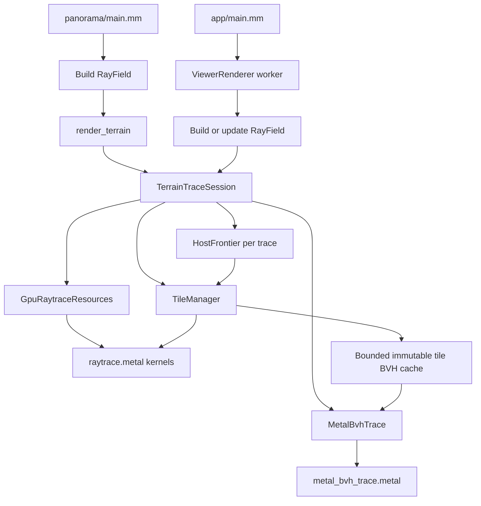
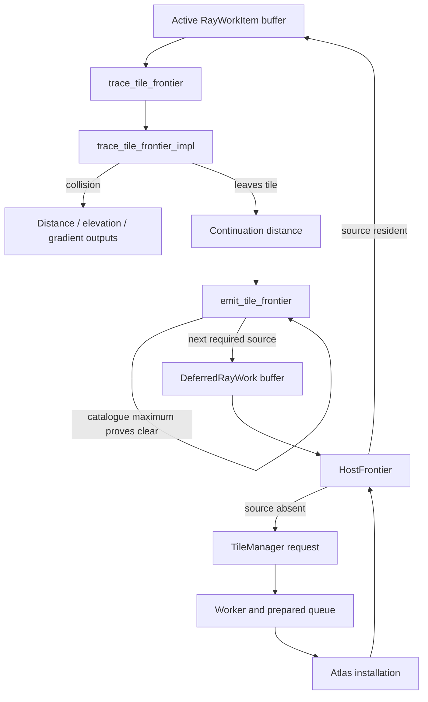
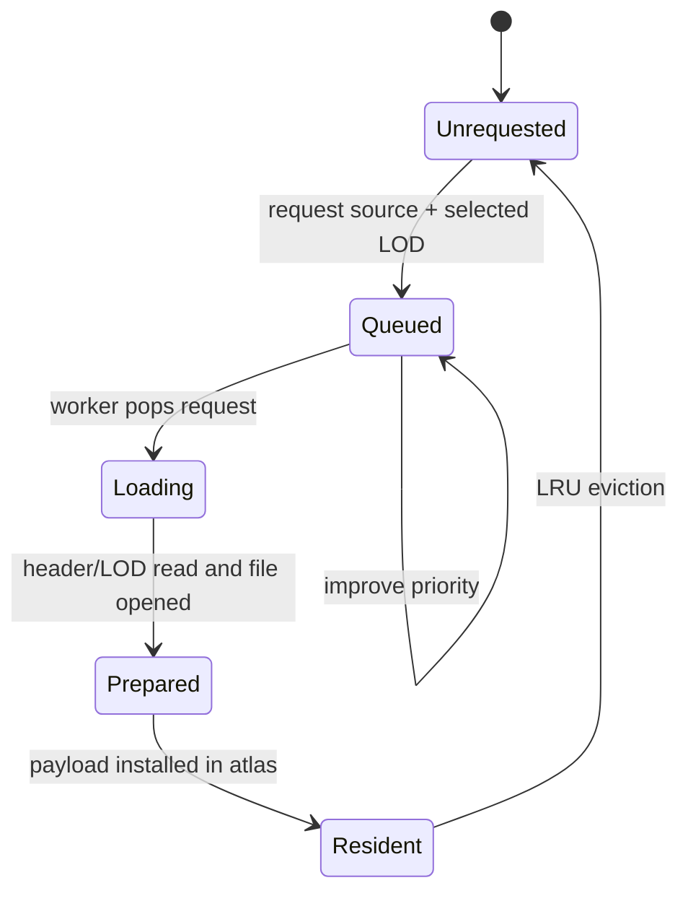

# Source architecture

Panorama turns prepared digital terrain model (DTM) tiles into distance,
elevation, normal, shadow, and colour images. The expensive work is performed
by Metal kernels. The software backend alternates between GPU traversal and
host-side scheduling while terrain tiles are loaded asynchronously. The Metal
BVH backend streams cached tile acceleration structures, with a manifest BVH
selecting tiles and Metal instance transforms applying observer curvature.

This document follows a request from an executable down to the terrain kernels.

## Source directories

- `panorama/` implements the batch command. It parses a projection and output
  request, performs one trace, presents the selected products, and writes PNGs.
- `app/` implements the persistent AppKit viewer. Its render worker coalesces
  interaction into the newest requested frame and reuses one tracing session
  across camera movement and appearance-only changes.
- `raytracing/` owns ray projection, catalogue discovery, asynchronous tile
  residency, host frontier scheduling, Metal dispatch, and terrain kernels.
- `rendering/` converts completed trace buffers into diagnostic or shaded
  images. Presentation changes do not retrace terrain unless shadows or camera
  geometry changed.
- `tile-gen/` reads source DEMs and writes the prepared `.ptile` format used by
  ray tracing.
- `shared/` contains the `.ptile` format, manifest, and argument utilities used
  by more than one executable.

## Request flow

The batch and interactive entry points converge on `TerrainTraceSession`:

`RayField` is the projection-independent input to tracing: one normalized
horizontal direction and vertical slope per output pixel. The CLI creates a
short-lived session. The viewer retains its session so the catalogue, tile
atlas, worker threads, and Metal pipelines survive changes in heading, pitch,
field of view, and observer location.

## Session setup

`TerrainTraceSession` establishes objects in an order that avoids circular
ownership:

1. `TileManager` discovers `.ptile` files, creates the immutable
   `TerrainCatalogue`, reads the reference tile geometry, and selects one LOD
   for every source.
2. `GpuRaytraceResources` selects the Metal device, compiles the Float32 or
   retained-uint16 pipelines, allocates per-ray buffers, and uploads a compact
   tile-key-to-source hash table.
3. `TileManager::attach_gpu` allocates its atlas on that device, synchronously
   installs the observer tile in slot zero, builds its maximum-elevation
   mipmap, and starts loading workers.

The catalogue is immutable for the session. A viewer relocation inside that
catalogue only rebases resident tile coordinates and recalculates LOD choices.
Moving beyond it causes the app to construct a replacement session.

## Metal BVH primary tracing

`MetalBvhTrace` shares the session's device, queue, ray buffers, and output ABI.
It copies each selected LOD from `TileManager` before allowing that atlas slot
to be reused. Each cached BVH owns its vertices independently of atlas eviction
and software shadow passes. Float32 and retained uint16 use the same block metadata
with byte offsets and per-tile quantization bases.

Each primitive covers up to `bvh_block_cells` cells per axis. The bounds kernel
scans the block's actual vertices and conservatively encloses elevation minus
effective-Earth curvature. The intersection function repeats an inclusive slab
test before any terrain access, then walks only the block's cells using the
shared collision and normal helpers in `terrain_intersection.metalh`. The ray
remains `(dx, dy, slope)` with horizontal-distance parameterization. A successful
hit is checked against catalogue coverage so missing tiles terminate rays just
as they do in the software frontier.

The backend builds a primitive acceleration structure, reads back its compacted
size, and completes copy-and-compact before releasing build storage. All
indirect intersection-table resources are declared on every trace encoder.
Submissions finish synchronously before parameters, outputs, or cache entries may
change. A small catalogue BVH contains one conservative manifest box per tile.
Version 2 manifests carry minima and maxima over all LODs; missing bounds use
conservative finite columns. Candidate rays wait in source buckets. Processing
outward Manhattan grid shells gathers all incoming rays before loading a source,
so even a one-tile cache does not repeatedly build that source within a frame.

Detailed tile bounds enclose `h(u,v) - k*(u*u+v*v)` around the tile centre.
For centre offset `a = tile_centre - observer`, each Metal instance maps
`(u,v,z)` to `(u+a.x, v+a.y, z-2*k*dot(a,(u,v))-k*dot(a,a))`.
The callback tests the local AABB but uses the original world ray in the shared
collision solver, preserving its horizontal parameter and normal convention.
Movement rebuilds only small catalogue and batch instance hierarchies. Cached
tile BVHs are keyed by source and LOD and survive observer changes.

Admission reserves terrain buffers, original/compacted acceleration structures,
and build scratch before loading. LRU entries are evicted only between completed
submissions. The independent `bvh_cache_size_bytes` budget excludes ray-sized
work/output buffers and the small upper hierarchies. A cache smaller than one
tile's peak build requirement is rejected with the required byte count.
Timing separates GPU traversal, tile loading/building, and instance setup under
the inclusive streaming trace, so cold construction cannot masquerade as tracing.
The software shadow frontier remains available and consumes hardware primary
outputs through the unchanged session interface.

## One primary tracing pass

Each ray begins in the observer tile. A GPU pass traces only the segments whose
terrain is currently resident:

`GpuRaytraceResources::trace_frontier` encodes `trace_tile_frontier` and
`emit_tile_frontier` into the same command buffer. The first kernel traverses
one resident tile and writes either a collision or the distance at which the
ray leaves it. The second kernel walks across catalogue tiles whose published
maximum elevation proves they cannot intersect the ray, then emits one
`DeferredRayWork` for the first source that needs detailed traversal.

After the command completes, `HostFrontier` groups those continuations by
catalogue source. It activates resident work near the closest outstanding
segment and asks `TileManager` for missing sources. The distance window keeps
independent rays progressing together and limits LRU churn. A ray has at most
one active or deferred segment at any time; debug builds validate this
invariant.

## TileManager lifecycle

`TileManager` owns everything concerning terrain files and residency.
`HostFrontier` knows only source indices, atlas slots, and installed variants.

Requests are deduplicated by `TileVariant`, which is a source index plus a
one-based terrain LOD. Workers perform control-plane work—reading metadata,
selecting the LOD record, and opening a Metal file handle—then place a compact
`PreparedTile` in a bounded queue. The render thread installs prepared tiles
only between completed GPU passes, so an atlas slot is never overwritten while
a kernel can read it.

Installation prefers an unused slot and otherwise chooses the least recently
used unpinned slot. Metal I/O copies only the selected LOD byte range. Uint16
data either remains quantized or is converted to Float32 by a compute kernel.
The manager then builds a conservative maximum-elevation mipmap and publishes
the slot mapping and lifecycle transition together. Compressed inputs use a
staging copy when Metal I/O cannot begin directly at an unaligned LOD offset;
uncompressed aligned ranges retain the direct path.

Terrain-point inspection also belongs to `TileManager`. It samples an existing
resident LOD-1 slot when possible; otherwise it retains one separately loaded
LOD-1 payload. This shares catalogue lookup and Metal-I/O resources with
tracing without forcing coarse render tiles to be refined merely for a cursor
query.

## Traversal inside a tile

The public kernels `trace_tile_frontier` and
`trace_tile_frontier_quantized` select the atlas representation and call the
templated `trace_tile_frontier_impl` in `raytracing/raytrace.metal`.

The implementation combines two structures:

- a 2D DDA advances the ray through aligned terrain blocks; and
- a maximum-elevation mipmap rejects blocks that lie completely below the
  curvature-adjusted ray.

Traversal starts coarse for an incoming tile. A possible intersection descends
the mipmap until level 1, where the ray is intersected exactly with the cell's
bilinear surface. Clear neighboring blocks allow traversal to climb back to
coarser levels. The selected terrain LOD changes cell size and available
mipmap depth but retains a common atlas-slot stride.

The return value is deliberately a continuation distance rather than a tile
identifier. `emit_tile_frontier` owns neighbor selection and catalogue lookup;
the host later maps its source index to whichever atlas slot currently holds
the selected variant.

## Shadow tracing

Hard shadows reuse the same manager and host-frontier lifecycle:

1. `initialise_shadow_rays` reconstructs eligible collision positions, applies
   a self-intersection bias, and emits their starting sources.
2. `HostFrontier` requests and activates terrain exactly as for primary rays.
3. `trace_shadow_tile_frontier` invokes the same traversal template in
   any-hit mode. Its first collision clears the visibility byte.
4. `emit_shadow_tile_frontier` continues an unblocked ray from its individual
   collision origin rather than the shared camera origin.

Thus an off-screen or nonresident ridge can cast a shadow without maintaining
a second terrain cache.

## Presentation

Tracing produces shared Metal buffers for horizontal collision distance and,
when requested, elevation, packed surface gradients, and shadow visibility.
`GpuImageRenderer` combines those buffers with colour and lighting settings in
`rendering/image_renderer.metal`. The viewer can rerun presentation without
changing the terrain frontier; the CLI reads the resulting textures back and
encodes PNG files.

## Important invariants

- Catalogue source indices remain stable for a session.
- Each ray has no more than one active or deferred segment.
- Atlas installation occurs only after the preceding GPU command completes.
- Active slots receive fresh LRU stamps before their pass; installation waits
  until that pass has completed.
- LOD is part of tile identity; two LODs of one source are distinct variants.
- Maximum mipmaps are conservative rejection bounds, not collision surfaces.
- Exact collisions use the vertices belonging to the resident LOD.
- GPU ABI structs are mirrored explicitly between C++ headers and Metal; keep
  field order, width, and alignment synchronized when changing them.
